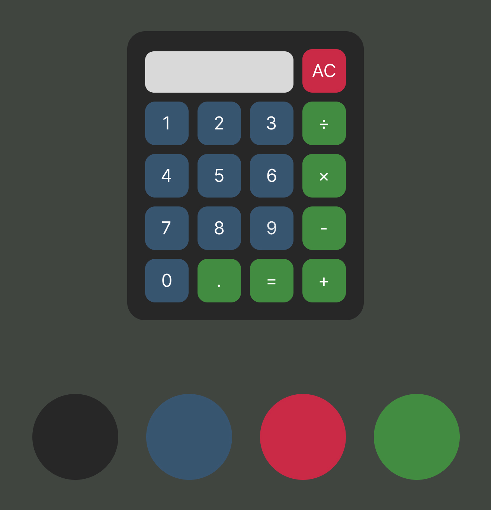

# Web Calculator

This project serves as a demonstration of my HTML, CSS, and JavaScript skills. I aim to create a simple calculator using vanilla HTML, CSS, and JavaScript.

## Project Overview

The calculator will include functions for basic mathematical operations, including:

- Addition
- Subtraction
- Multiplication
- Division

Each calculation will comprise two numbers and an operator. For instance, 3 + 5.

The calculator will feature CSS styling for a visually appealing interface and functional buttons for user interaction in the web browser. It will also support **keyboard input**, include a **backspace button** for error correction, and offer a **button** for decimal arithmetic.

## Mockup

Just because this is a simple project doesn't mean we shouldn't pay attention to the visual aspect. I've created a mockup using Figma to illustrate how I envision the design of the calculator.

  

## Flowchart

I conducted a small experiment where I aimed to elucidate the logic or steps through a flowchart. This is merely a basic guide on its functionality. However, it remains incomplete as I still need to incorporate the float point functionality.

  

------------------------